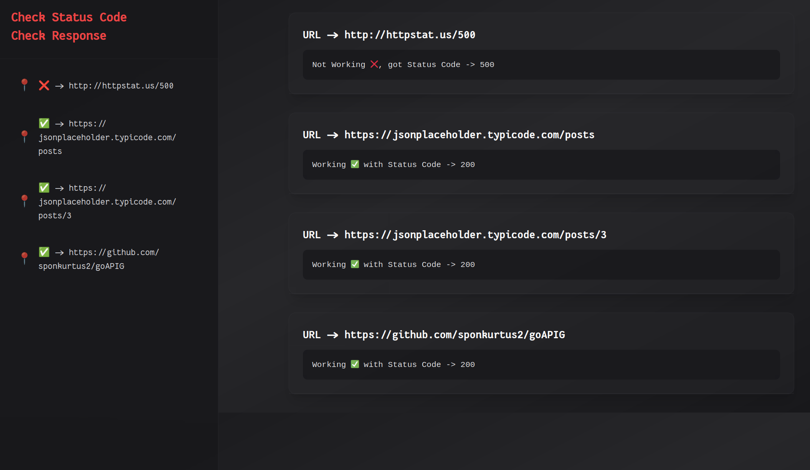
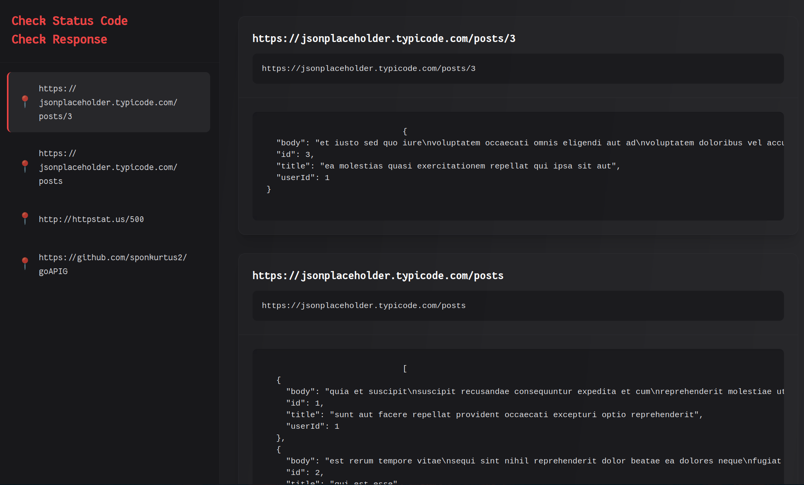

# goAPIG Documentation

## Overview

goAPIG is a lightweight Golang tool designed to simplify the process of testing multiple GET APIs. While tools like Insomnia and Postman are excellent for individual API testing, they can become time-consuming when dealing with a large number of endpoints. goAPIG streamlines this process by allowing you to test multiple APIs simultaneously and view their status and responses in one place.

## Features

    - Batch Testing: Test multiple GET APIs in one go.

    - Status Monitoring: Quickly check if your APIs are working (HTTP 200) or failing (HTTP 500).

    - Response Preview: View the actual responses from your APIs.

    - Easy Configuration: Set up your API endpoints using a simple config.yaml file.

    - Local HTTP Server: Run a local server to interact with your APIs and view results.

## Installation

### Cloning
1. Git clone -> https://github.com/sponkurtus2/goAPIG.git
2. go mod tidy
3. go build
4. ./goAPIG

### Installing from go packages


## Configuration

goAPIG uses a config.yaml file to manage the list of APIs you want to test, the config.yaml will be initialized once you run the program for the first time in ~/.goApig/. Here’s an example configuration:
```yaml
apis:
  - "www.api.com"
  - "www.api.com"
  - "www.api.com"
```
# Usage

Once you’ve set up your config.yaml and started the application, goAPIG will launch a local HTTP server. You can interact with it using the following routes:

1. Status Overview (/)
    Description: Displays a list of all configured APIs along with their status (HTTP 200 for success, HTTP 500 for failure).
    Access: Open http://localhost:8080/ in your browser.

2. Response Details (/get)
    Description: Displays the actual responses from the APIs that are working (HTTP 200).
    Access: Open http://localhost:8080/get in your browser.

# Gallery



